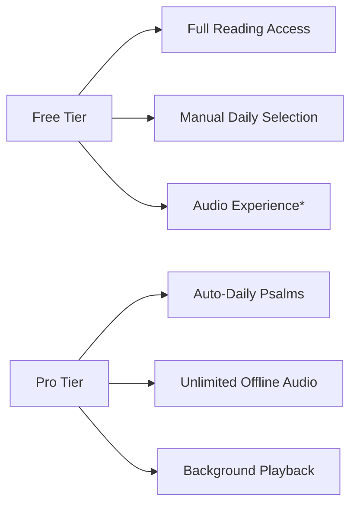

# Psalms app for Android

The Psalms android app presents the Hebrew text exactly as in our printed publications, sourced meticulously from the *Leningrad Codex*. Faithful to the original poetic structure, Psalms are rendered as lyrical verses—not rectangular prose blocks—with each psalm divided into phrase-by-phrase segments that mirror natural recitation pauses, enhanced by modern punctuation for intuitive reading. The audio features an authentic 1976 Sephardic pronunciation recording, reciting the same Hebrew text, masterfully altered using AI technology to remove background noise, coughs, and minor errors while preserving the vocalization and improve the voice.

## Core Experience

A beautifully designed Hebrew Psalms browser with generous free access and optional premium enhancements. All users enjoy full reading capabilities, while audio experiences are unlocked through meaningful engagement.

## Key Features

1.  ### Three Reading Systems
    * *Book Division*: Psalms organized traditionally into 5 books
    * *Daily Reading*: Psalms assigned to each day of the month
    * *Balanced Schedule*: 4-week rotation with daily selections

2.  ### Intuitive Navigation
    * Swipe left/right between Psalms
    * Quick jump menu with Hebrew/Arabic numerals
    * Touch-friendly chapter buttons

3.  ### Hebrew-Centric Design
    * Right-to-left layout
    * Authentic Torah script font
    * Gematria verse numbers
    * Sacred name handling (יהוה)

4.  ### Audio Experience System
    * **Free Tier**: Earn listening access through engagement
    * **Pro Tier**: Unlimited offline audio with auto-scroll
    * Background playback capability

## Tiered Access

