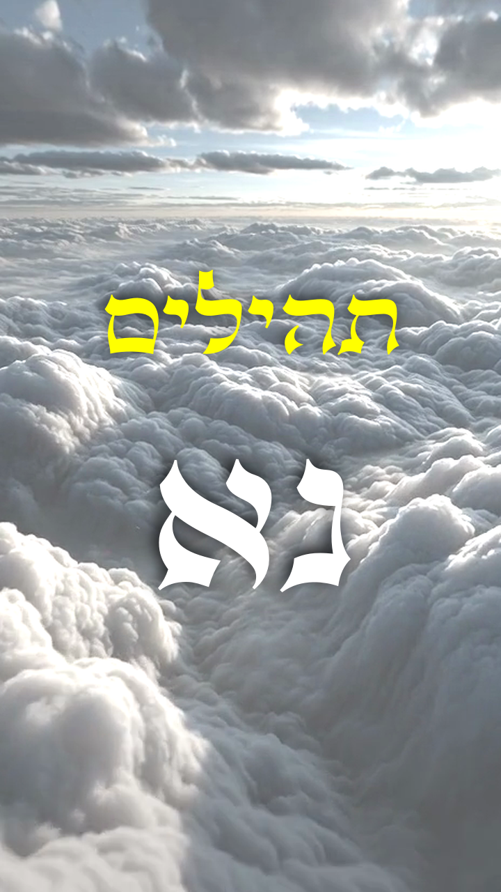
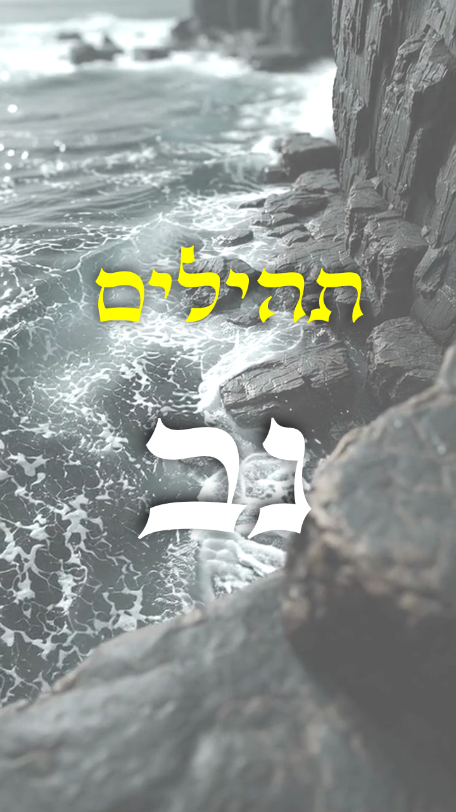
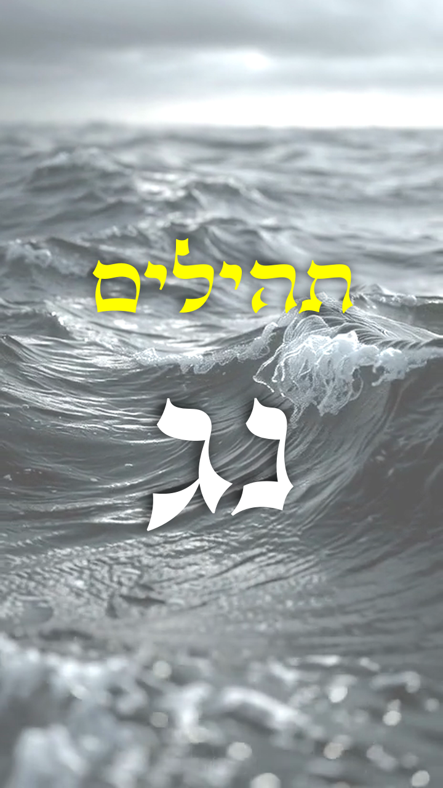
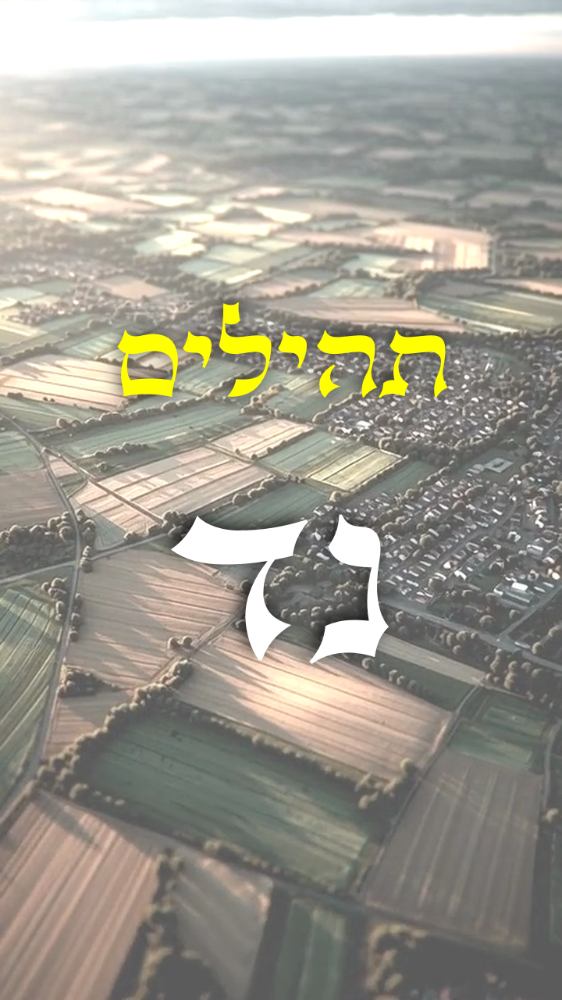
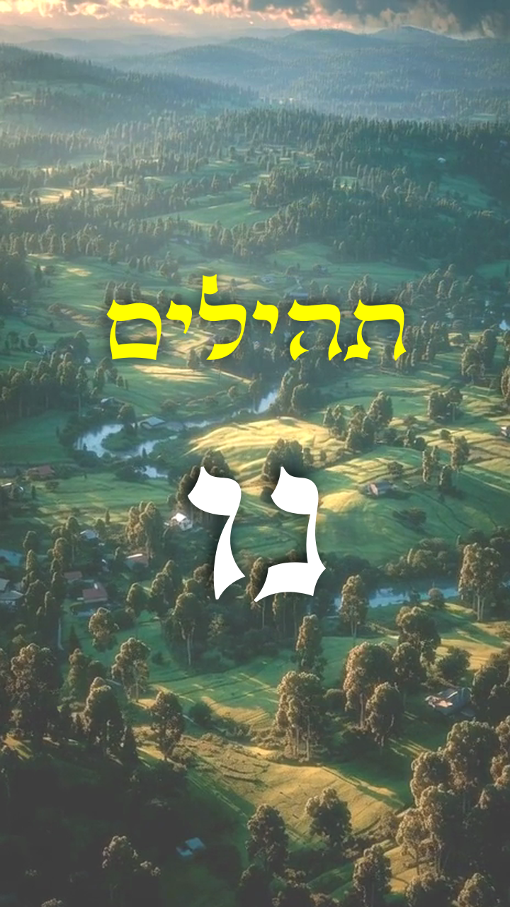
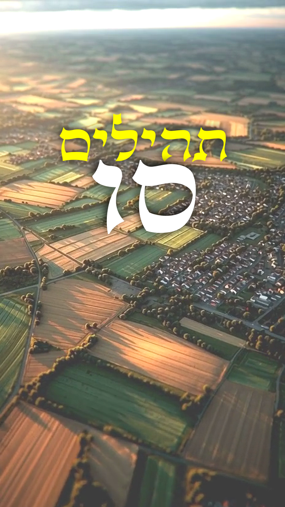
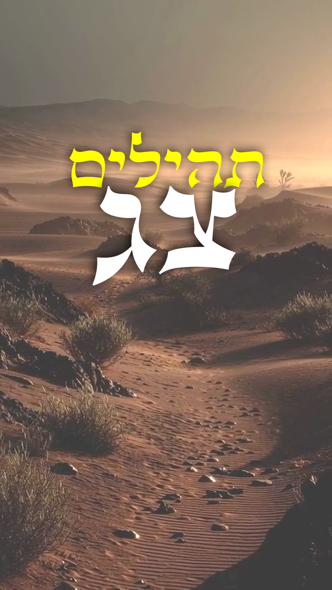
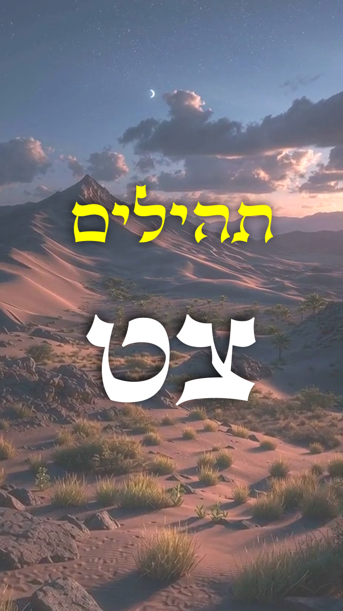
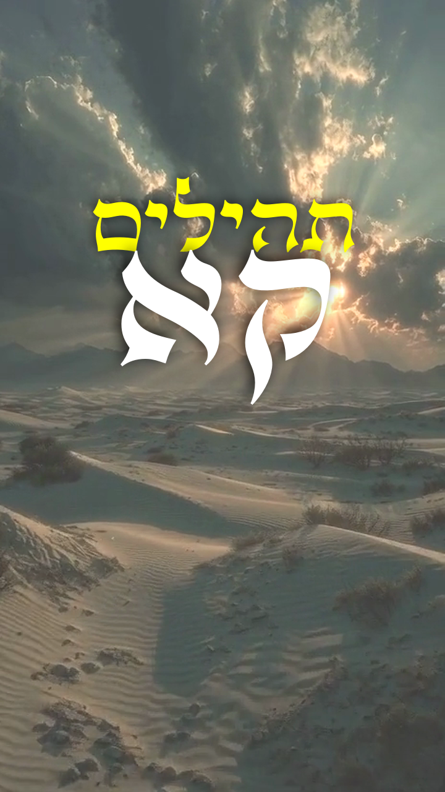

# Psalms Series

The **Psalms Series** publishes individual chapters of the *Book of Psalms*.

Each chapter is set to a background song generated with **Suno**, accompanied by video segments created with **Midjourney**. A separate raw version (without music or background imagery) is also published.

**Audio foundation:** The narration is based on Abraham Shmuelov’s historic Leningrad Codex readings, refined with AI voice cloning for clarity while retaining the original Sephardic pronunciation.

**Distribution:** YouTube, YouTube Shorts, Instagram, TikTok, Spotify (audio-only), WhatsApp Channel, and the IVR phone line.

## Releases

### Psalm 8

A psalm by King David, opening and closing with wonder at the greatness of God's name across the whole earth. At its center stands the question of why God takes notice of humanity at all — and the astonishing answer that he has placed humans just below the divine, crowning them with glory and giving them dominion over all creation.

<video preload="none" controls="controls" height="200" width="356"
	poster="https://raw.githubusercontent.com/ReubenInstitute/Media/main/psalms/covers/horizontal/psalm008.jpg">
	<source src="https://raw.githubusercontent.com/ReubenInstitute/Media/main/psalms+/horizontal/psalm008.mp4" />
</video>

### Psalm 46

A song by the sons of Korah (Korach, from the tribe of Levi, whose sons became temple musicians), declaring that God is a refuge and a source of strength no matter what collapses around them— mountains, kingdoms, the earth itself. At its center is a vision of God's city, secure and unshakeable, while chaos reigns everywhere else. The psalm closes with God's own voice commanding stillness: "let go, and know that I am God."

<video preload="none" controls height="200" width="356"
	poster="https://raw.githubusercontent.com/ReubenInstitute/Media/main/psalms/covers/horizontal/psalm046.jpg">
	<source src="https://raw.githubusercontent.com/ReubenInstitute/Media/main/psalms+/horizontal/psalm046.mp4" />
</video>

### Psalm 75

A psalm by Asaf (Asaph, King David's chief musician), opening with thanksgiving before God himself speaks— declaring that he alone sets the time of judgment and holds the world steady. The arrogant are warned not to boast, since it is God who raises one person and brings another down. The psalm ends with the promise that the power of the wicked will be broken, and the righteous will rise.

<video preload="none" controls height="200" width="356"
	poster="https://raw.githubusercontent.com/ReubenInstitute/Media/main/psalms/covers/horizontal/psalm075.jpg">
	<source src="https://raw.githubusercontent.com/ReubenInstitute/Media/main/psalms+/horizontal/psalm075.mp4" />
</video>

### Psalm 90

A prayer by Moses (Moshe), the only psalm attributed to him, contrasting God's eternity with the brevity and fragility of human life. A thousand years are like a single day to God— while human beings sprout and wither like grass. The psalm ends not in despair but in petition: teach us to count our days wisely, and let the work of our hands endure.

<video preload="none" controls height="200" width="356"
	poster="https://raw.githubusercontent.com/ReubenInstitute/Media/main/psalms/covers/horizontal/psalm090.jpg">
	<source src="https://raw.githubusercontent.com/ReubenInstitute/Media/main/psalms+/horizontal/psalm090.mp4" />
</video>

### 150 Day Psalm Cycle

The 150 Day Psalm Cycle publishes one psalm per day, drawn round‑robin from the five books to maximise variety across emotional and poetic terrain.

| No | Book | Psalm |
|-----|------|----------|
| 1 ✅ | 1 | 8 |
| 2 ✅ | 2 | 46 |
| 3 ✅ | 3 | 75 |
| 4 | 4 | 90 |
| 5 | 5 | 117 |
| 6 | 1 | 32 |
| 7 | 2 | 44 |
| 8 | 3 | 84 |
| 9 | 4 | 93 |
| 10 | 5 | 129 |
| 11 | 1 | 35 |
| 12 | 2 | 47 |
| 13 | 3 | 86 NEW |
| 14 | 4 | 99 |
| 15 | 5 | 130 |
| 16 | 1 | 41 |
| 17 | 2 | 48 |
| 18 | 3 | 79 NEW |
| 19 | 4 | 100 |
| 20 | 5 | 113 NEW |
| 21 | 1 | 2 OLD |
| 22 | 2 | 50 |
| 23 | 3 | 82 NEW |
| 24 | 4 | 101 |
| 25 | 5 | 121 NEW |
| 26 | 1 | 15 OLD |
| 27 | 2 | 51 |
| 28 | 3 | 88 NEW |
| 29 | 4 | 104 NEW |
| 30 | 5 | 108 NEW |
| 31 | 1 |  |
| 32 | 2 |  |
| 33 | 3 |  |

---

## Downloads

### Psalm 8

| | Audio | Video |
| --- | --- | --- |
| Library | [🎵 MP3 44.1Khz](https://raw.githubusercontent.com/ReubenInstitute/Media/main/psalms/psalm008.mp3) | [🖼 MP4 1920x1080](https://raw.githubusercontent.com/ReubenInstitute/Media/main/psalms/psalm008.mp4) |
| Score | [🎵 MP3 44.1Khz](https://raw.githubusercontent.com/ReubenInstitute/Media/main/psalms+/psalm008.mp3) | [🖼 MP4 720x1280](https://raw.githubusercontent.com/ReubenInstitute/Media/main/psalms+/psalm008.mp4) |
| Cinematic | | [🖼 MP4 720x1280](https://raw.githubusercontent.com/ReubenInstitute/Media/main/psalms+/cinematic/psalm008.mp4) |

### Psalm 46

| | Audio | Video |
| --- | --- | --- |
| Library | [🎵 MP3 44.1Khz](https://raw.githubusercontent.com/ReubenInstitute/Media/main/psalms/psalm046.mp3) | [🖼 MP4 1920x1080](https://raw.githubusercontent.com/ReubenInstitute/Media/main/psalms/psalm046.mp4) |
| Score | [🎵 MP3 44.1Khz](https://raw.githubusercontent.com/ReubenInstitute/Media/main/psalms+/psalm046.mp3) | [🖼 MP4 720x1280](https://raw.githubusercontent.com/ReubenInstitute/Media/main/psalms+/psalm046.mp4) |
| Cinematic | | [🖼 MP4 720x1280](https://raw.githubusercontent.com/ReubenInstitute/Media/main/psalms+/cinematic/psalm046.mp4) |

### Psalm 75

| | Audio | Video |
| --- | --- | --- |
| Library | [🎵 MP3 44.1Khz](https://raw.githubusercontent.com/ReubenInstitute/Media/main/psalms/psalm075.mp3) | [🖼 MP4 1920x1080](https://raw.githubusercontent.com/ReubenInstitute/Media/main/psalms/psalm090.mp4) |
| Score | [🎵 MP3 44.1Khz](https://raw.githubusercontent.com/ReubenInstitute/Media/main/psalms+/psalm075.mp3) | [🖼 MP4 720x1280](https://raw.githubusercontent.com/ReubenInstitute/Media/main/psalms+/psalm090.mp4) |
| Cinematic | [🖼 MP4 720x1280](https://raw.githubusercontent.com/ReubenInstitute/Media/main/psalms+/cinematic/psalm075.mp4) |

---

## Old Releases

### Psalm 32

### Psalm 35

### Psalm 41

<a href="https://drive.google.com/file/d/1vfLAk1R8wKIJullvj3-ZqA0yPrlFpApc/view">Psalm 41<!--  --></a>

### Psalm 44

<a href="https://drive.google.com/file/d/1bPpi6ZjYJEttR_Y8VYrw0wfZUI16gKbj/view">Psalm 44<!--  --></a>

### Psalm 47

<a href="https://drive.google.com/file/d/1DGXZfsqEsPoB_cAKZE9ZjRjHOzwhnC4a/view">Psalm 47<!--  --></a>

### Psalm 48

<a href="https://drive.google.com/file/d/1queLhyZ9c0qCZHibVhuqj1IDvHuwONAs/view">Psalm 48<!--  --></a>
### Psalm 50

<a href="https://drive.google.com/file/d/1clN5ESEWQ6x6b9BPsjDqdngbEeHrzMRH/view">Psalm 50<!--  --></a>

### Psalm 51

### Psalm 52

### Psalm 53

### Psalm 54

### Psalm 56

### Psalm 59

### Psalm 60

### Psalm 61

### Psalm 66

### Psalm 67

### Psalm 70

<a href="https://drive.google.com/file/d/1trlyfcNjI7N3NGGIjq93XoMLl_5kZ215/view">Psalm 70<!--  --></a>

### Psalm 84

<a href="https://drive.google.com/file/d/1p4MXjtPpieCwNt7vaR7LyFqwZzH7CN32/view">Psalm 84<!--  --></a>

### Psalm 90

### Psalm 93

### Psalm 99

### Psalm 100

### Psalm 101

<a href="https://drive.google.com/file/d/1gox4WxF2-Ubg95PkO2KJExQtIyO20c7e/view">

### Psalm 117

### Psalm 129

### Psalm 130

## Old Videos

### Psalm 2

### Psalm 3

### Psalm 4

### Psalm 5

### Psalm 6

### Psalm 7

### Psalm 10

### Psalm 12

### Psalm 15

### Psalm 17

### Psalm 19

### Psalm 20

### Psalm 22

### Psalm 23

### Psalm 26

### Psalm 30

### Psalm 43
